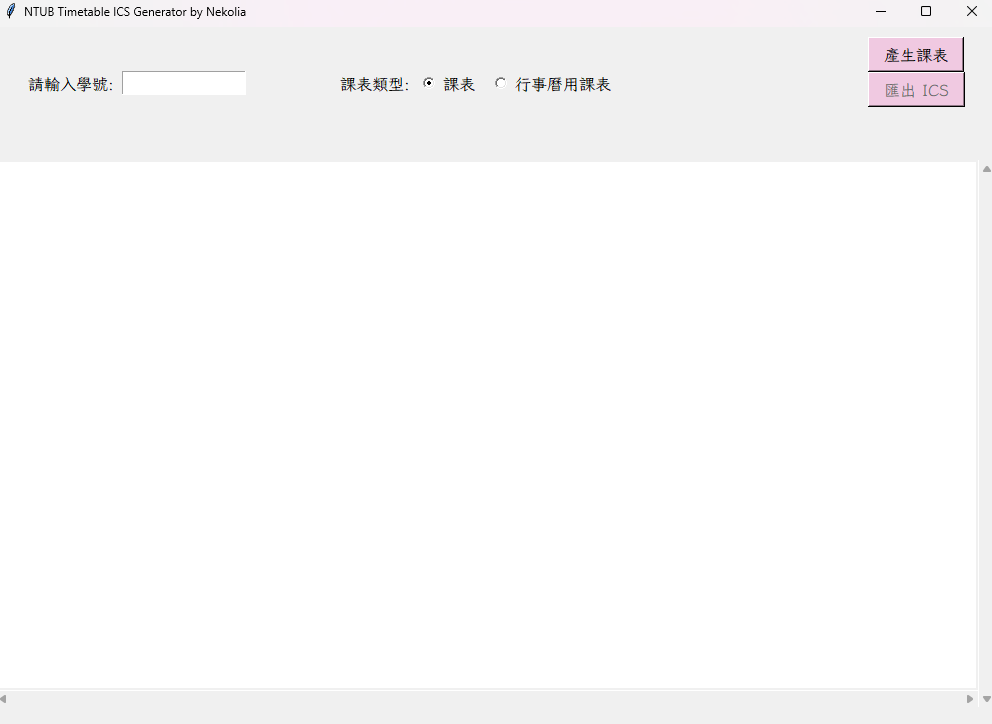

# NTUB課表兼行事曆製作器  

  

嗨嗨，這裡因為Nekolia跑去耍廢而出來說明的Alicia，應該是多琳娜事務所的第一個作品。  

本專案，簡而言之就是一個自動生成ics檔案(iCalendar, [RFC 5545](https://datatracker.ietf.org/doc/html/rfc5545)  ) 的軟體，應該只要是智慧型產品都能支援。  

技術方面簡單來說就是沒有技術，Python加上Ai assistance的效率好可怕。  
  

## Development   

要有Python（雖然會看到這個的人應該都有）。  

```
pip install requirement.txt  
```

### 程式啟動  

```
python codes/gui.py  
```

### 我資料呢?  
我知道你很急，但你先別急，資料在 ics_file 資料夾裡面，接下來就是你的工作了，我相信你能加進日曆裡的。   
  
  

## Contribution     

其實我不知道能Contribution什麼，有了，現在只能製作以下一週為起始的ics。  

## Credits  


大家有試過點看看那個 **匯出Excel檔** 嗎，如果沒有的話強烈建議要點一次，本來以為會給CSV的（等等，暴雷禁止）。總之，key行事曆的時候蠻痛苦的。  
  
這邊特別感謝 [arthurc0102](https://github.com/arthurc0102) 的Api，沒有你我真不知道這要怎麼做出來，如果有幸能讓您看到的話務必告訴我方式。  


