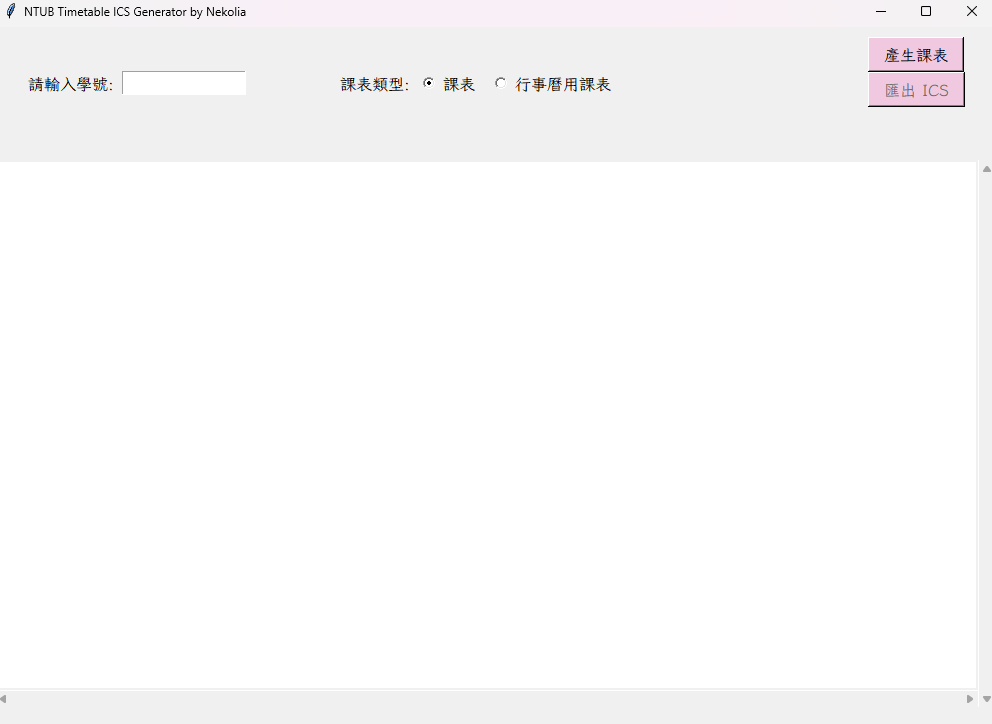

# NTUB課表兼行事曆製作器  

  

嗨嗨，這裡因為Nekolia跑去耍廢而出來說明的Alicia，應該是多琳娜事務所的第一個作品。  

本專案，簡而言之就是一個把你的課表變成ics檔案(iCalendar, [RFC 5545](https://datatracker.ietf.org/doc/html/rfc5545)  ) 的軟體，應該只要是智慧型產品都能支援。  

技術方面簡單來說就是沒有技術，Python加上Ai assistance的效率好可怕。  
  

## Development   

要有Python（雖然會看到這個的人應該都有）。  

```
pip install -r requirements.txt  
```

### 程式啟動  

```
python codes/gui.py  
```

### 外觀 / 主題  

介面走 **Material Design 3**，配色是 **Monet 動態取色**：程式啟動時會去讀你的桌面桌布，抓出主色當種子色，再展開成整套 M3 tonal palette。支援 GNOME、Raspberry Pi OS (pcmanfm / wayfire)、XFCE、KDE；抓不到就安靜退回預設的紫色，不會影響使用。

- 右上角 `☾` / `☀` 切換淺色與深色。  
- 右上角 `◐` 打開主題設定，可以挑內建色票、重新從桌布擷取，或自己用調色盤選一個。  
- 選擇會記在 `~/.config/ntub_timetable_ics/settings.json`，下次開啟沿用。  

配色演算法是自己寫的（`codes/theme.py`），沒有額外依賴，樹莓派上跑起來一樣輕。想看色階跟對比度檢查的話：

```
python codes/theme.py
```

字型的部分，Tk 沒辦法直接載入專案裡的 `font/Iansui-Regular.ttf`，要把它裝進系統字型才會生效；沒裝的話會自動退到 Noto Sans CJK TC 等中文字型。

### 我資料呢?  
我知道你很急，但你先別急，資料在 ics_file 資料夾裡面，接下來就是你的工作了，我相信你能加進日曆裡的。   
  
  

## Contribution     

其實我不知道能Contribution什麼，有了，現在只能製作以下一週為起始的ics。  

## Credits  


大家有試過點看看那個 **匯出Excel檔** 嗎，如果沒有的話強烈建議要點一次，本來以為會給CSV的（等等，暴雷禁止）。總之，key行事曆的時候蠻痛苦的。  
  
這邊特別感謝 [arthurc0102](https://github.com/arthurc0102) 的Api，沒有你我真不知道這要怎麼做出來，如果有幸能讓您看到的話務必告訴我方式。  


## Others

> [!CAUTION]
> 若因為此程式而造成任何侵犯隱私若其他造成毀滅性問題的話不要來找我，不過可以在issue裡面討論  
> 對，這是免責聲明。